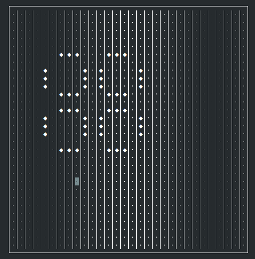
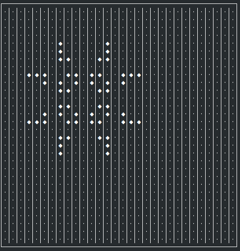
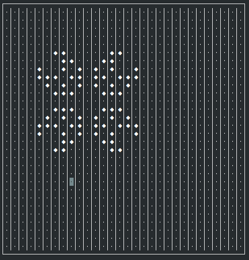

# Introduction
This is a C++ program which implements Conway's Game of Life using NCurses

# Controls
* Arrow keys - Move the cursor around the grid
* Enter - Toggle a cell as alive/dead (alive is a diamond shape)
* Space - Run an iteration of the game
* c - Clear the game board
* q - Exit the program

# Running the Program

		git clone https://github.com/sidheart/conways-game.git
		cd conways-game
		make all
		./cgol

# Dependencies
* libncurses5

# Important
This program has only been confirmed to run on Unix machines with NCurses support.
The program requires a terminal with that is at least 32x32 characters.
Resizing the terminal window while the program is executing will cause errors.

# Screenshots

